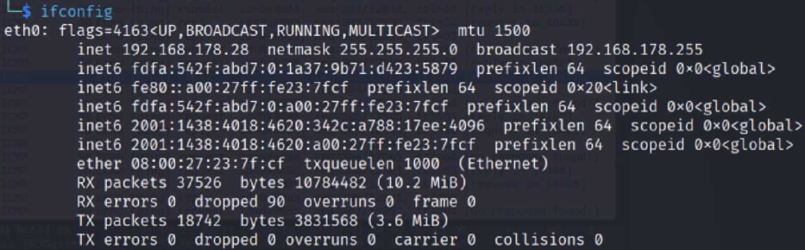
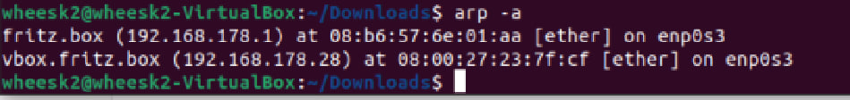

## ARP Spoofing MITM — Network Hacking Adventure
Welcome to my cyber-lab!
This repo is all about discovering, experimenting, and documenting what really happens when you combine Python, Scapy, Wireshark, and a dash of curiosity on a local network.

If you’ve ever wondered “how do hackers actually pull off a man-in-the-middle attack?”—this is your step-by-step, screenshot-rich answer.

---
##  Disclaimer
For educational and ethical use only.

Always have permission before testing on any network.

Breaking the rules isn’t hacking—it’s just trouble.

---

## Introduction 
Have you ever read about MITM attacks and thought, “That sounds complicated”?
I used to think so, too—until I built one from scratch, watched the packets fly in Wireshark, and realized it’s equal parts science and sorcery.

This project covers:

Encrypting messages with DES, AES, and RSA (because attackers and defenders both need crypto!).

Crafting and sending packets using Scapy.

Launching a real ARP spoofing attack to become the “invisible router” on my LAN.

Analyzing everything in Wireshark, with real screenshots and commentary.

---

## Lab Setup
Attacker: Kali Linux VM (bridged mode), Python 3, Scapy, Wireshark

Victim: Ubuntu VM on the same LAN

Gateway: Standard home router

Network Interface: eth0



---

## Encryption Playground
Before diving into attacks, I wanted to see how classic and modern encryption actually works at the byte level.

AES Encryption and Decryption (with CBC Mode)
Step-by-step explanation:
1.	We create a 16-byte secret key for AES.
2.	We create a cipher object for encryption (using CBC mode, which is secure).
3.	The code pads the message to the correct length, then encrypts it.
4.	The code prints out the encrypted data and the special IV (Initialization Vector) needed to decrypt.
5.	To decrypt, we use the same key and IV, and the code prints the decrypted message.


DES Encryption and Decryption (with CBC Mode)
Step-by-step explanation:
1.	We create an 8-byte secret key for DES.
2.	We set up the DES cipher object for encryption (also in CBC mode).
3.	The message is padded, encrypted, and the result plus IV are printed out.
4.	For decryption, the same key and IV are used, and the decrypted message is shown


Scripts in /aes_des/ encrypt and decrypt a sample message.

Comparasion table: 


# RSA Encryption: 
## Step 1: Set up the keys

•	We pick two large prime numbers, p and q.

•	Calculate n = p * q (the modulus for both keys).

•	Calculate phi_n = (p-1)*(q-1) (used in key calculations).

•	Choose a public exponent e (commonly 17, 65537, etc.).

•	Calculate the private exponent d, which is used for decryption.

## Step 2: Encrypt the message

•	For each character in the message, get its Unicode number (ord(char)).

•	Encrypt that number with the formula:

encrypted_char = (char_number ^ e) mod n

•	This is done for each character and stored as a list.

## Step 3: Decrypt the message

•	For each encrypted number, apply the formula:

decrypted_char = (encrypted_number ^ d) mod n

•	Convert back to the character using chr().


--- 

## Packet Crafting 101
What if you could send your own message—encrypted or not—right onto the wire?
With Scapy, I crafted custom UDP packets, stuffed in a DES-encrypted payload, and watched them hit the LAN.

- How to run:
- See /packet-crafting/.
- Edit the IPs, run as root, and capture in Wireshark.

For this demonstration, I set the key directly in my code (hardcoded):
key = b'8bytekey'
- This key is 8 bytes long, which is required for DES.

- I used the same key in both the sender and receiver scripts, so that both can encrypt and decrypt messages

•	This key is 8 bytes long, which is required for DES.
•	I used the same key in both the sender and receiver scripts, so that both can encrypt and decrypt messages

•	This key is 8 bytes long, which is required for DES.
•	I used the same key in both the sender and receiver scripts, so that both can encrypt and decrypt messages

1) Encrypting the packet payload(sender script)


Wireshark: 


2) Decrypting the Packet Payload (Receiver Script)


--- 

## ARP Spoofing MITM Attack

Here’s where the magic (and mischief) happens.
This script uses Scapy to poison the ARP tables of both the victim and the gateway—so all their traffic goes through me, the attacker.

How it works:

Edit the IPs in /mitm/sender_arp.py.

Run with sudo, and watch as the attack floods the LAN with fake ARP replies.


## What Actually Changes on the Network?
Victim’s ARP table:

The gateway’s IP now maps to the attacker’s MAC (not the real router!).

Gateway’s ARP table (optional):

The victim’s IP maps to the attacker’s MAC.

Before: 


After:


--- 

## Wireshark Analysis
This is where you “see the unseen.”

ARP Traffic

Filter: arp

Look for forged ARP replies like

```bash 
192.168.178.1 is at 08:00:27:23:7f:cf
```
Make sure the “is at” MAC is YOURS (the attacker), not the real gateway.


## MITM in Action: Intercepted Traffic
Filter: icmp (for ping)

Ping from victim to gateway. See both requests and replies flowing through the attacker.

Filter: http (if you browse HTTP sites)

Filter: dns (for DNS lookups)


--- 

## What I Learned
This project turned abstract networking concepts into hands-on discoveries.

Encryption became more real when I saw my own bytes scrambled and unscrambled.

ARP spoofing went from “just theory” to “I see it live in Wireshark!”

I learned the importance of IP forwarding (to avoid accidental DoS).

Most importantly, I realized how easy it is to become invisible on a LAN—and why network security matters so much.

And yes, Wireshark is now officially my favorite “hacker microscope.”

--- 

## Credits & License
Built by Sardor Samandarov — for learning, sharing, and making networks a little safer.

MIT License

Use this repo to learn and defend—never to harm.

--- 

## Final Note
Feel free to explore, fork, or reach out if you want to talk security, Wireshark, or Python!

Stay curious, and remember: the best hackers are the best learners.


2) Decrypting the Packet Payload (Receiver Script)


>>>>>>> 8d9a03bf3768217c78e85d1b89dfae4103dbdafb
